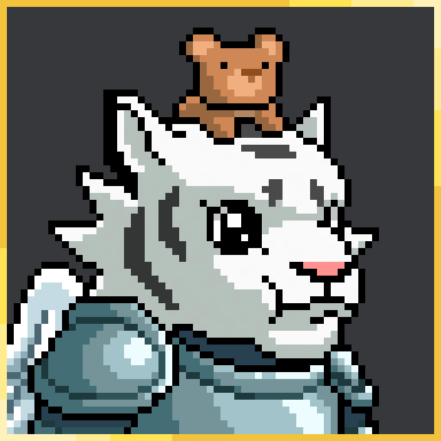
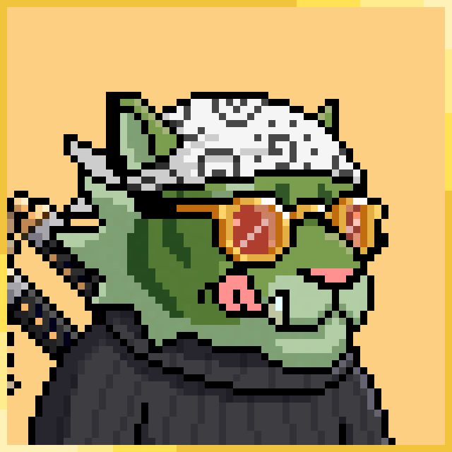

# Team

More information about the team & council will be available soon.

## Founders 

### Simba Tan

.png>)

🐦 [@hasabullaaa](https://twitter.com/hasabullaaa)  — :clap: AKA namejeff.eth#2568 — 🇸🇬 Singapore (GMT+8)

Hi! I'm a Computer Science student wholly interested in blockchain technology. I work as part-time dev, full-time NFT degen.

### Omilatte

🐦 [@666joestar](https://twitter.com/666joestar)  — :clap: AKA Omilatte#6969 — 🇸🇬 Singapore (GMT+8)

I’m a Business student, with an interest in Human Resources and Business Analytics from Singapore. Also an extrovert, so I love making new friends. Pop-punk and anime enthusiast.&#x20;

_Some words I live by: Trust the vibes_&#x20;

## Team 

### **Raelynn Chan**

.png>)

🐦 [@aer\_thonks](https://twitter.com/aer\_thonks)  — :clap: AKA Rae#8099 — 🇸🇬 Singapore (GMT+8)

Hey everyone! I'm currently working as a 2D game artist with a diploma in game, art & design. Passionate about character design & game dev + dabbled in other areas such as UI design, animation & scripting.&#x20;

### Kai Yang

🐦 [@xfatedx3](https://twitter.com/xfatedx3)  — :clap: AKA xfated#7645 — 🇸🇬 Singapore (GMT+8)

Hi, friends. Techie & Software engineer to be. Dabbled in crypto and journeying into the NFT space.

_Life = Eat, Sleep, Code, Repeat_

### Lio Lim

:clap: AKA Lio#3182 — 🇸🇬 Singapore (GMT+8)

**Game Developer**

Hi! I'm Lionel, but you can call me Lio! I am a student with a strong passion for code, design, and games! I wish to use my skills to conceptualise, design, and develop player-facing aspects of games that impress the player throughout every step of their experience.&#x20;

I find pleasure in front-end development, technical art, and game design. My recent games are made using Unity, and you can find them here: [https://lio-lim.itch.io/](https://lio-lim.itch.io/) I hope you enjoy them as much as I enjoyed making them!

## Council 

### Sam **Path**

.png>)

🐦 [@directorsvm](https://twitter.com/DIRECTORSVM)  — :clap: AKA supremesam#1337 — 🇺🇸 United States (GMT-8)

**Technical Project Manager / WEB3 Builder**&#x20;

I started mining cryptocurrency as a teen, got lucky, and it turned out to be worth something!\
I am ex Netflix, Google, and Apple in my career. I currently help product teams at multiple companies launch their visions through my project management workflows.&#x20;

### Zak Lewis

🐦 [@zaklewis\_eth](https://twitter.com/zaklewis\_eth)  — :clap: AKA JuJu#1111 — 🇬🇧 United Kingdom (GMT)

A highly skilled IT professional with a background in cybersecurity, dedicated to improving the development methods used to create new IT solutions, and environments in order to deliver successful applications.

Experience with data warehousing, web platform development, and information service delivery. Managed multidisciplinary teams in complex settings in multiple locations.

A team orientated worker able to collaborate with all departments of the business, in order to complete projects in an efficient and timely manner, by implementing and automating end to end continuous build, integration, delivery, release, deployment process and pipeline.

With over 8 years of experience in the Blockchain realm.

### Jonathan Beaudoin

 (1).png>) 

🐦 [@jonathanbeaudo6](https://twitter.com/JonathanBeaudo6)  — :clap: AKA JoBeau#6393 — 🇨🇦 Canada (GMT-4)

Hi I'm Jonathan but everybody knows me as JoBeau (pronounced jobo)&#x20;

Worked in the video industry for over 10 years as a director and content creator for brands such as Cirque du Soleil, Mastercard, SAP solutions, Opera of Montreal and more.&#x20;

My skills also span the clothing industry as a representative for brands such as Obey, DC shoes, Billabong and Quicksilver.

I am technically sound in premiere pro and after effects for video editing. I have been working with the biggest DJs in the world on live video performances.&#x20;

_Dedicated to bridging web3 and real life._

### Montana Turner

.png>) 

🐦 [@lustrate](https://twitter.com/lustrate)  — :clap: AKA lustrate#8379 — 🇺🇸 United States (GMT-7)

**Community Leader**

I work in the oil industry as a Lead in creating lubrications. I’ve been in the NFT space since late 2021. I started my mod career for PixelTigers from the very start with the founders. You probably also know me from the Digi Dragonz.&#x20;

I’m continuously learning and evolving my mindset to bring as much value as I can to the WEB3 space.

## Moderator 

### I-Lin Lee

.png>)

🐦 [@mistyblu23](https://twitter.com/mistyblu23)  — :clap: AKA MacyBlu#3262 — 🇸🇬 Singapore (GMT+8)

Hi, I’m I-Lin 🙆🏻‍♀️ for those who don’t already know, Macy’s my furkid 🐶&#x20;

Bought my first Crypto in Feb 2021, never thought I’d spend any of them on NFTs but here I am. Worked in regional marketing for Universal Music until I got tired of it. These days I spend my time doing what I enjoy which is yoga, taking care of my doggos, IRL family and learning about NFTs from my web3 family.\
