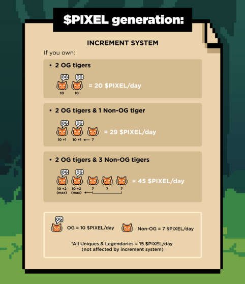

# $PIXEL

The $PIXEL token is earned by staking your tigers. This process is automatic and doesn't require any further actions.&#x20;

$PIXEL will be used in all aspects of our ecosystem as we expand and grow. $PIXEL is an ERC-20 token, meaning it is on the Ethereum blockchain. It is structured the same way as tokens such as $APE from Yuga Labs.

**1 $PIXEL = 1 $PIXEL**


It is important to note that $PIXEL is a utility token for the PixelTiger’s ecosystem and is not a security. It has no monetary value.


## $PIXELS token

The $PIXEL token is live.

Here is the Etherscan link for the Ethereum $PIXEL token smart contract: \
[https://etherscan.io/address/0x28f6691ACe7a960eD6B549A2c486982e89F963fc](https://etherscan.io/address/0x28f6691ACe7a960eD6B549A2c486982e89F963fc)

## Token usage

The token can be used across our ecosystem such as:

* WL Shop
* Merchandise Shop
* Breeding
* Evolution
* Redeem VX

## Token generation

The $PIXEL token is generated based on the type of Tiger you hold. $PIXEL can only be claimed from the website/contract.

* Cubs = 0 $PIXEL daily
* Tiger = 7 $PIXEL daily
* Tigers OG = 10 $PIEXEL daily
* Unique Tigers = 15 $PIXEL daily
* Ledgandary Tigers = 15 $PIXEL daily

