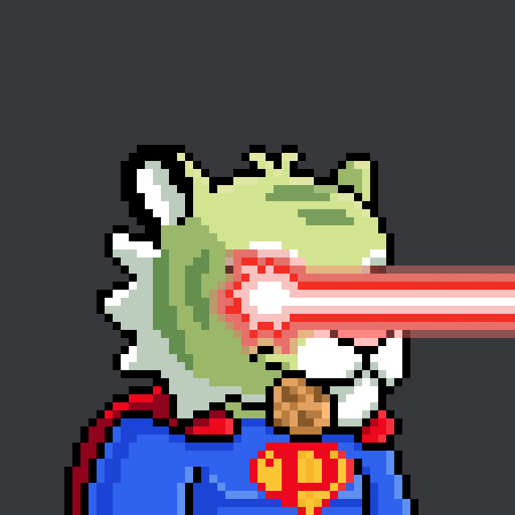
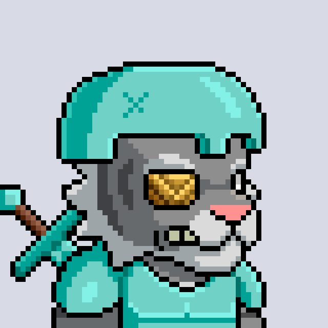
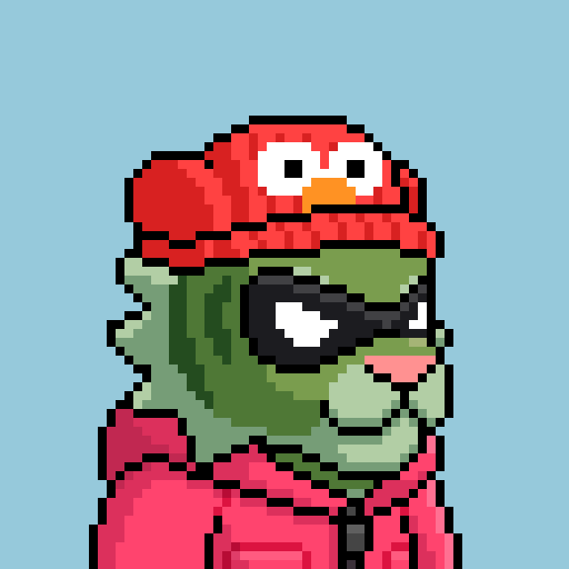

# 🐯 Collection

## Tigers

Tigers are the Genesis collection of PixelTigers ecosystem. There are 4444 Tigers that will ever be created.&#x20;

`Collection: 4444`\
`Legendary: 20`\
`Unique Tigers: 40`\
`OG Tigers: 1111`\
`Non-OG Tigers: 3273`

Collection wallet: 0x0D6402d20106B6E34a1bD63597B2e4B8C9229Ca9


Minting Tigers has been split into multiple phases. Currently, only 1600 have been minted. Stay tuned for the next phase.&#x20;


.gif>) .png>) .png>) .png>)

### Legendary Tigers

Yes! We have a total of **20** legendary Tigers. All our legendary Tigers are fully animated and stand out among the remainder of the collection.&#x20;

Legendary Tigers produce the most amount of $PIXELS per day. Only **10** legendary Tigers have been minted and the remainder will be available in the next phase of Tiger mint.

### Unique Tigers

You guessed it, uniques tigers are 1:1. There are **40** unique Tigers in total, some have been minted already and the remainder will be minted during the next phase.

### OG Tigers

Staying loyal to our early members, the first **1111** mints became OG Tigers which can be told apart using the gold border. The OG Tigers produce more $PIXELS than regular Tigers making them a valuable asset within our ecosystem.

### Non-OG Tigers

Content coming soon.&#x20;

## Cubs

Through the efforts of 2 different Tigers and 1000 $PIXELS, life can be given to a Cub.&#x20;

All Cubs born through $PIXELS will have their own unique traits, with a maximum of **8888** Cubs to be bred. Cubs are crucial to our ecosystem. These little cuties will have their own utility within The Jungle.&#x20;

Create a pack and you'll be ready for anything to come.

.png>)   

### Unique Cubs

Out of the 8888 Cubs, there will be an unknown amount of Cubs that will have a unique feature meaning they are 1:1.&#x20;

Unique Cubs are scattered around the collection so everybody has a chance of breeding a unique Cub.

## Mutated / Evolved Tigers

Sometime in the future within the Jungle tigers may get affected by deadly creatures, some may survive, but the remainder will be infected!


This phase hasn't begun. Stay tuned.


## The Jungle (Land)

TBA
